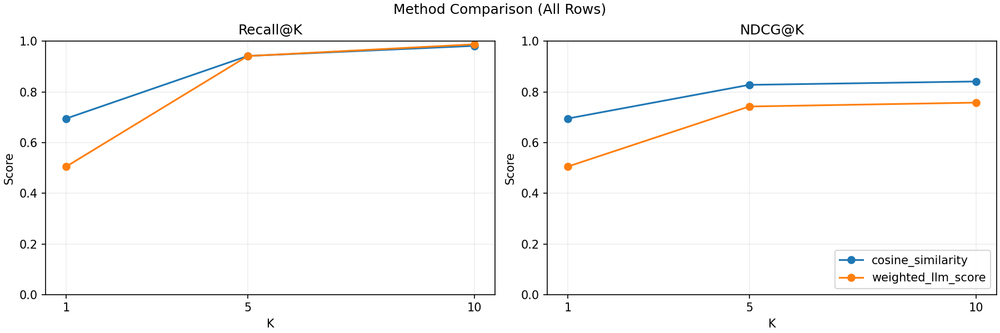

# Sara retrieve + rerank project

This repository is a structured version of the original Colab notebook `sara_retrieve+rerank.ipynb`.

The current pipeline is preserved:

1. Load candidates from `vacancy_conditioned_candidates.jsonl`.
2. Load vacancies from `vacancies_safe_ml_dataset_nozip.jsonl`.
3. Convert vacancies into LangChain `Document` objects.
4. Build a Chroma vector index with Hugging Face embeddings.
5. Retrieve top vacancies for each candidate.
6. Save candidate-vacancy matches.
7. Evaluate Recall@K and inspect misses.

## Project layout

```text
.
├── notebooks/
│   ├── sara_retrieve_rerank_original.ipynb
│   └── sara_retrieve_rerank_refactored.ipynb
├── src/sara_retrieve_rerank/
│   ├── config.py
│   ├── data.py
│   ├── preprocessing.py
│   ├── documents.py
│   ├── vector_store.py
│   ├── retrieval.py
│   ├── evaluation.py
│   └── visualization.py
├── scripts/
│   ├── setup_env.sh
│   ├── check_env.py
│   ├── build_index.py
│   ├── run_retrieval.py
│   └── evaluate.py
├── tests/
├── data/
│   ├── raw/
│   ├── processed/
│   └── chroma/
├── outputs/
├── AGENTS.md
├── IMPROVEMENTS.md
├── requirements.txt
└── pyproject.toml
```

## Data files

Put these files into `data/raw/`:

```text
data/raw/vacancy_conditioned_candidates.jsonl
data/raw/vacancies_safe_ml_dataset_nozip.jsonl
```

The notebook originally expected these files in the working directory. The structured version defaults to `data/raw/`, but all scripts accept CLI path overrides.

## Recommended local setup on macOS / VS Code

Always call pip through the Python interpreter you are actually using. This avoids the common macOS problem where `python3` points to Homebrew Python but `pip` points to a broken `/usr/local` Python.

From the project root:

```bash
cd /Users/r.nesterov/Downloads/sara_retrieve_rerank_project
python3 -m venv .venv
source .venv/bin/activate
python -m ensurepip --upgrade
python -m pip install --upgrade pip setuptools wheel
python -m pip install -r requirements.txt
python -m pip install -e .
python scripts/check_env.py
```

Then select this interpreter in VS Code:

```text
Command Palette -> Python: Select Interpreter -> .venv/bin/python
```

Run the script with the venv Python:

```bash
python scripts/evaluate.py
```

Or, without activating the environment:

```bash
.venv/bin/python scripts/evaluate.py
```

You can also run the setup helper:

```bash
bash scripts/setup_env.sh
```

If your default `python3` is too new for one of the ML packages, install Python 3.11 or 3.12 and run:

```bash
PYTHON_BIN=python3.11 bash scripts/setup_env.sh
```

## Run the pipeline

Build an index only:

```bash
python scripts/build_index.py
```

Run retrieval for all candidates and save matches:

```bash
python scripts/run_retrieval.py
```

Default retrieval now writes top-20 matches per candidate (`TOP_K=20`) for faster rerank
feature generation. Evaluation can still compute Recall@K up to 100 because it retrieves
directly from Chroma during `scripts/evaluate.py`.

Optional: print Recall@K directly from produced match rows (no extra retrieval pass):

```bash
python scripts/run_retrieval.py --report-recall-ks 20
```

To measure `recall@100`, run retrieval with `--top-k 100` and request both Ks:

```bash
python scripts/run_retrieval.py \
  --top-k 100 \
  --output-path data/processed/candidate_vacancy_matches_top100.jsonl \
  --report-recall-ks 20 100
```

Evaluate Recall@K:

```bash
python scripts/evaluate.py
```

To explicitly print `recall@20` and `recall@100` from Chroma:

```bash
python scripts/evaluate.py --ks 20 100 --misses-k 100
```

### Retrieval metrics snapshot

From cached match files in `data/processed/`:

| Retrieval run | Candidates with ground truth | Recall@20 | Recall@100 |
| --- | ---: | ---: | ---: |
| top-20 output (`candidate_vacancy_matches_top20.jsonl`) | 4,995 | 0.6677 (3,335 / 4,995) | n/a (max rank is 20) |
| top-100 output (`candidate_vacancy_matches_top100.jsonl`) | 4,995 | 0.6705 (3,348 / 4,995) | 0.7926 (3,959 / 4,995) |

## Reranking experiment

Create the same top-K retrieval output plus labeled reranker feature rows:

```bash
python scripts/run_retrieval.py --feature-output-path data/processed/rerank_features_top20.jsonl
```

Add LLM expert score columns such as `location_score`, `seniority_score`,
`salary_score`, `experience_score`, and `general_score`:

```bash
python scripts/score_rerank_experts.py --max-rows 100
```

For rate-limit safety, configure `.env` (see `.env.example`) or export:

```bash
export RERANK_REQUEST_DELAY_SECONDS=2.0
export RERANK_RATE_LIMIT_MAX_RETRIES=6
export RERANK_RATE_LIMIT_BACKOFF_BASE_SECONDS=2.0
export RERANK_RATE_LIMIT_BACKOFF_MAX_SECONDS=60.0
export RERANK_MAX_CONCURRENCY=1
export RERANK_MICRO_BATCH_SIZE=4
export RERANK_MICRO_BATCH_AUTOTUNE=true
export RERANK_SCORING_VALIDATION_FRACTION=0.2
export RERANK_TRAIN_MAX_NEGATIVES_PER_CANDIDATE=1
export RERANK_VALIDATION_MAX_NEGATIVES_PER_CANDIDATE=19
export RERANK_LLM_PROVIDER=litellm
export RERANK_LLM_MODEL=mistral/mistral-small-latest
```

`scripts/score_rerank_experts.py` auto-loads `.env` from the project root before parsing CLI args.

`score_rerank_experts.py` now:
- scores only candidate groups where retrieval contains at least one positive label,
- for LLM scoring only: subsamples negatives per candidate separately for train
  and validation (`RERANK_TRAIN_MAX_NEGATIVES_PER_CANDIDATE` and
  `RERANK_VALIDATION_MAX_NEGATIVES_PER_CANDIDATE`),
- asks for all five expert fields in one JSON response per candidate-vacancy pair,
- supports micro-batching multiple pairs into one LLM request (`RERANK_MICRO_BATCH_SIZE`),
- retries rate-limited calls with exponential backoff,
- sleeps between requests,
- supports additive resume mode with `--rewrite-mode` and periodic persistence
  with `--checkpoint-every`,
- prints progress while scoring.

With top-20 retrieval, row count and scoring cost depend heavily on the negative
sampling caps above. Use smaller train caps for cheaper LLM scoring and larger
validation caps for stronger reranker evaluation coverage.

For faster and safer runs, keep `RERANK_MAX_CONCURRENCY=1` unless your provider quota is high.
Optionally use a local model (for example Ollama) to avoid hosted API rate limits:

```bash
export RERANK_LLM_PROVIDER=ollama
export RERANK_LLM_MODEL=ollama_chat/qwen2.5:3b-instruct
export RERANK_LLM_API_BASE=http://localhost:11434
export RERANK_MAX_CONCURRENCY=1
export RERANK_REQUEST_DELAY_SECONDS=0
python scripts/score_rerank_experts.py
```

Use quick benchmark mode to test the pipeline on ~5% of users before long runs:

```bash
python scripts/score_rerank_experts.py --benchmark-mode
```

Optional benchmark controls:
- `--benchmark-user-fraction` (default from `RERANK_BENCHMARK_USER_FRACTION=0.05`)
- `--benchmark-seed`
- `--micro-batch-size` and `RERANK_MICRO_BATCH_AUTOTUNE=true` to auto-keep batching only when it is faster on a short local benchmark.

Then compare the original cosine ranking with a weighted LLM baseline:

```bash
python scripts/evaluate.py --rerank-features-path data/processed/rerank_features_scored_top20.jsonl
```

To train and validate a LightGBM LambdaRank model on the cached feature rows:

```bash
python scripts/evaluate.py --rerank-features-path data/processed/rerank_features_scored_top20.jsonl --train-lambdarank
```

When `--train-lambdarank` is enabled, the script now also saves:
- train rows for LightGBM (`data/processed/lambdarank_train_rows_top20.jsonl`)
- validation rows (`data/processed/lambdarank_validation_rows_top20.jsonl`)
- validation rows with `lambdarank_score` (`data/processed/lambdarank_validation_scored_top20.jsonl`)
- fitted model (`outputs/lambdarank_model_top20.pkl`)

It prints metrics for:
- baseline cosine on all rows
- baseline weighted expert average on all rows
- cosine on LambdaRank validation split
- weighted expert average on LambdaRank validation split
- LambdaRank score on the same validation split

It also prints compact method-comparison tables and saves comparison charts by default:
- `outputs/rerank_method_comparison_all_rows.png`
- `outputs/rerank_method_comparison_validation.png` (when `--train-lambdarank` is used)

### Latest reranking results (top-20, scored features)

Command:

```bash
python scripts/evaluate.py --rerank-features-path data/processed/rerank_features_scored_top20.jsonl --train-lambdarank
```

Dataset summary:

| Metric | Value |
| --- | ---: |
| Feature rows loaded | 28,760 |
| Candidate groups (all rows) | 3,333 |
| LambdaRank train rows | 15,420 |
| LambdaRank validation rows | 13,340 |
| LambdaRank train groups | 2,666 |
| LambdaRank validation groups | 667 |
| Train rows per group | 5.78 |
| Validation rows per group | 20.00 |

All rows comparison:

| Method | Recall@1 | NDCG@1 | Recall@5 | NDCG@5 | Recall@10 | NDCG@10 | Δ NDCG@10 vs cosine |
| --- | ---: | ---: | ---: | ---: | ---: | ---: | ---: |
| `cosine_similarity` | 0.6949 | 0.6949 | 0.9418 | 0.8278 | 0.9817 | 0.8411 | +0.0000 |
| `weighted_llm_score` | 0.5053 | 0.5053 | 0.9415 | 0.7423 | 0.9877 | 0.7576 | -0.0834 |

Validation comparison (same split used for LambdaRank model validation):

| Method | Recall@1 | NDCG@1 | Recall@5 | NDCG@5 | Recall@10 | NDCG@10 | Δ NDCG@10 vs cosine |
| --- | ---: | ---: | ---: | ---: | ---: | ---: | ---: |
| `cosine_similarity` | 0.5517 | 0.5517 | 0.7901 | 0.6830 | 0.9085 | 0.7206 | +0.0000 |
| `weighted_llm_score` | 0.2729 | 0.2729 | 0.7256 | 0.5035 | 0.9385 | 0.5735 | -0.1471 |
| `lambdarank_score` | 0.6027 | 0.6027 | 0.9175 | 0.7683 | 0.9790 | 0.7884 | +0.0677 |

Key takeaway:
- On validation, LambdaRank improved `ndcg@10` from `0.7206` (cosine baseline) to `0.7884` (`+0.0677`).
- Funnel view:
  - retriever finds the true vacancy in top-20 for about `67.0%` of labeled candidates,
  - on the reranker validation split (top-20 hit groups), LambdaRank places the true vacancy
    at rank 1 in `60.3%` of cases and within top-10 in `97.9%` of cases.

Saved artifacts:
- `data/processed/lambdarank_train_rows_top20.jsonl`
- `data/processed/lambdarank_validation_rows_top20.jsonl`
- `data/processed/lambdarank_validation_scored_top20.jsonl`
- `outputs/lambdarank_model_top20.pkl`
- `outputs/rerank_method_comparison_all_rows.png`
- `outputs/rerank_method_comparison_validation.png`

Comparison plots:




The reusable reranking helpers live in `src/sara_retrieve_rerank/reranking.py`.
LightGBM is optional for the base retriever, but install the full requirements or
`python -m pip install -e ".[rerank]"` before using `--train-lambdarank`.
LambdaRank training keeps all positives and uses
`RERANK_TRAIN_MAX_NEGATIVES_PER_CANDIDATE` for train-group negative subsampling.
Validation-group negative subsampling for LLM scoring is controlled separately with
`RERANK_VALIDATION_MAX_NEGATIVES_PER_CANDIDATE`.

## VS Code notebook setup

Open `notebooks/sara_retrieve_rerank_refactored.ipynb` and select `.venv/bin/python` as the kernel.

The first notebook cell now detects the project root and adds `src/` to `sys.path`, so local imports work even before editable install. If dependency imports fail, run the optional install cell in the notebook.

## Colab setup

In Colab, upload this repo or clone it, then run the notebook's optional install cell. It uses the current kernel executable and the detected project root, which is more reliable than hard-coded `../requirements.txt` paths.

## Troubleshooting

### `ModuleNotFoundError: No module named 'langchain_core'`

Dependencies are not installed in the Python interpreter that ran the script. Use:

```bash
python -m pip install -r requirements.txt
```

Do not use plain `pip` unless you are sure it belongs to the same interpreter.

### `ModuleNotFoundError: No module named 'sara_retrieve_rerank'`

The project package is not installed or the notebook kernel does not know about `src/`. Use:

```bash
python -m pip install -e .
```

For notebooks, run the first bootstrap cell and select `.venv/bin/python` as the kernel.

### `zsh: command not found: python`

On macOS, `python` may not exist until a venv is activated. Use `python3` to create the venv, then activate it:

```bash
python3 -m venv .venv
source .venv/bin/activate
```

After activation, `python` should work.

## Good next refactoring targets

- Add BM25 / hybrid retrieval in a separate module.
- Add reranking as a separate `reranking.py` module.
- Add config files for experiments.
- Add cached Chroma persistence for faster iteration.
- Add small fixtures so tests can run without the full dataset.
