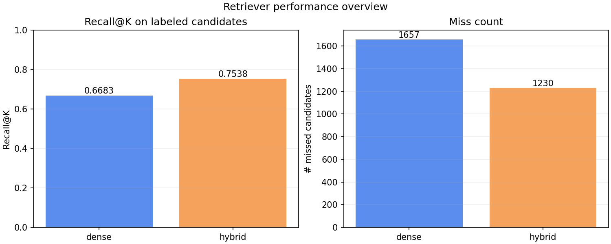
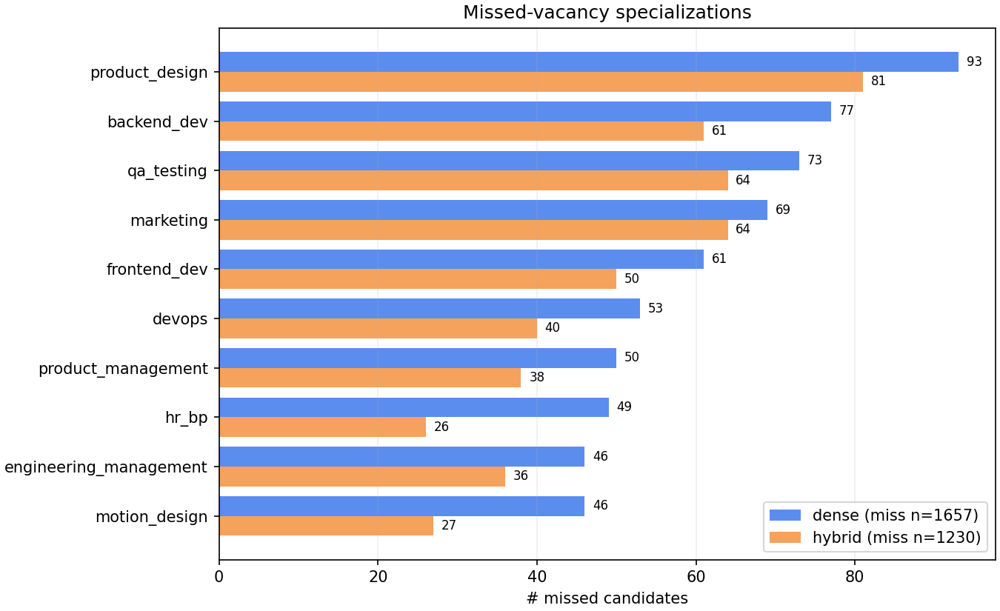
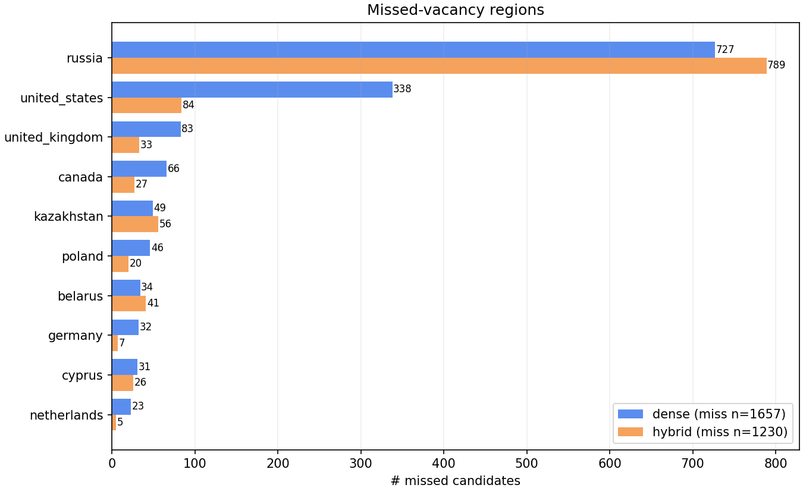
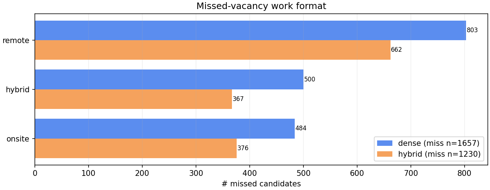
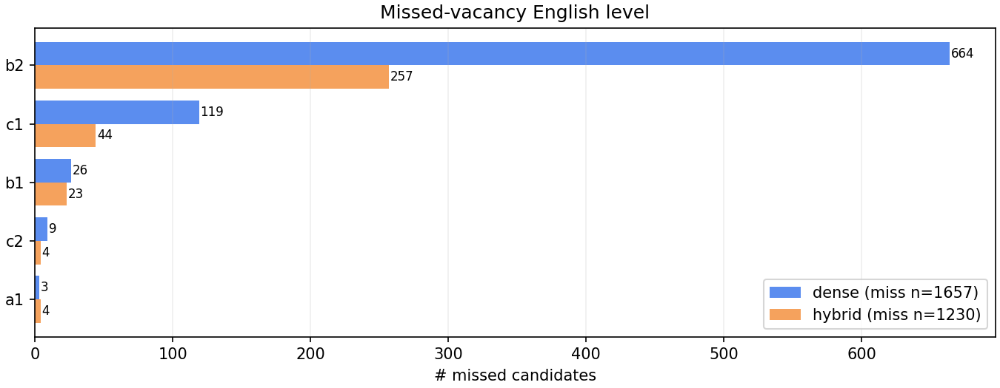
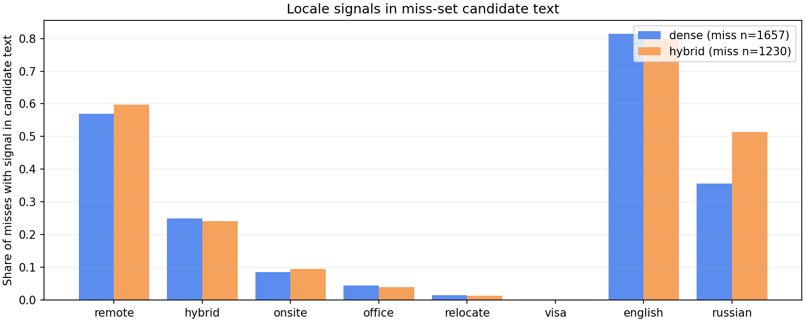
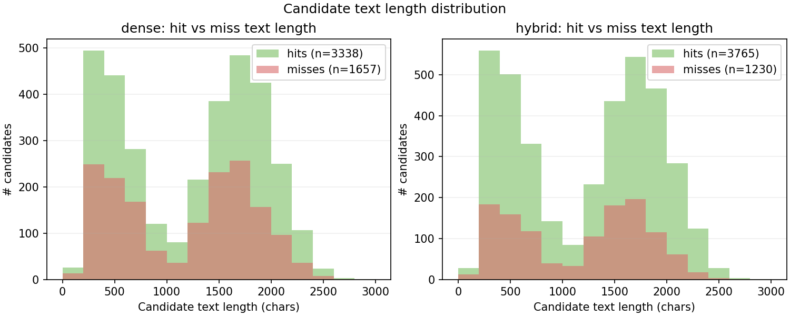
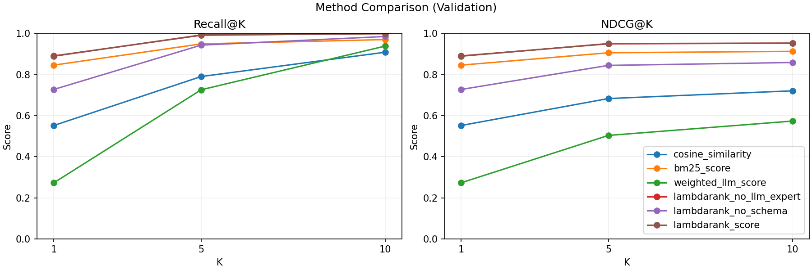

# Sara retrieve + rerank

Retrieval and reranking pipeline for the job listing matcher. Originally developed as a standalone Colab notebook (`notebooks/sara_retrieve_rerank_original.ipynb`); this module is the structured version of that work.

## Pipeline overview

1. Load candidates from `data/raw/results_5000_scores_acknowledged.jsonl`.
2. Load vacancies from `data/raw/vacancies_safe_ml_dataset_nozip.jsonl`.
3. Convert vacancies into LangChain `Document` objects.
4. Build a Chroma vector index with Hugging Face embeddings.
5. Retrieve top vacancies per candidate (dense, BM25, or hybrid).
6. Save candidate-vacancy matches.
7. Optionally score matches with LLM expert prompts and train a LambdaRank reranker.
8. Evaluate Recall@K and inspect misses.

## Module layout

```text
backend/services/sara_retrieve_rerank/
├── config.py            # YAML-overridable defaults
├── data.py              # JSONL I/O helpers
├── preprocessing.py     # text cleaning + candidate query
├── documents.py         # vacancy -> text + LangChain Documents
├── vector_store.py      # Chroma embedding + indexing
├── retrieval.py         # dense top-K retrieval
├── bm25_retrieval.py    # in-memory BM25 over vacancy docs
├── hybrid_retrieval.py  # RRF fusion of dense + BM25
├── reranking.py         # feature rows, LambdaRank, metrics
├── schema_features.py   # 82 tabular features from parsed schema
├── llm_logging.py       # JSONL audit log for LLM calls
├── pipeline.py          # end-to-end RecommendationPipeline
├── evaluation.py        # Recall@K + miss analysis helpers
└── visualization.py
```

Related paths (repo root):

```text
scripts/
├── setup_env.sh
├── check_env.py
├── build_index.py
├── run_retrieval.py
├── score_rerank_experts.py  # LLM expert scoring + schema enrich
├── evaluate.py              # baseline + 3-variant LambdaRank
├── analyze_misses.py        # text miss-analysis report
└── plot_miss_analysis.py    # PNG miss-analysis figures
notebooks/
├── sara_retrieve_rerank_original.ipynb
└── sara_retrieve_rerank_refactored.ipynb
tests/                       # 81 pytest tests
data/
├── raw/                     # input JSONL (gitignored)
├── processed/               # generated feature rows (gitignored)
└── chroma/                  # persistent dense index
outputs/                     # generated plots + LambdaRank model
config.yaml                  # path / model / sampling overrides
```

## Data files

Put these files into `data/raw/`:

```text
data/raw/results_5000_scores_acknowledged.jsonl   # candidates with id + text + ground-truth source_vacancy_id
data/raw/candidates_with_schema.jsonl             # same candidates parsed into a structured schema (LLM-extracted fields)
data/raw/vacancies_safe_ml_dataset_nozip.jsonl    # 10k vacancies with categorical metadata, salary, HTML body
```

`results_5000_scores_acknowledged.jsonl` is the canonical candidate text source consumed by retrieval / scoring scripts.
`candidates_with_schema.jsonl` is an optional companion file used by the reranker — when present, [schema_features.py](schema_features.py) turns each row into 82 numeric tabular features (`cand_*`, `vac_*`, `pair_*`). Missing the schema file is tolerated; the reranker just trains without those columns.

## Configuration

Module defaults in [config.py](config.py) can be overridden by a `config.yaml` file at the repo root. Any key missing from `config.yaml` (or a missing file altogether) falls back to the in-code default, so the YAML file is optional.

## Setup

From the repo root (the package is installed from `backend/services/`):

```bash
python -m venv .venv
# Windows: .venv\Scripts\activate
source .venv/bin/activate

pip install -e .[server,rerank,dev]
python scripts/check_env.py
```

If your default `python3` is too new for one of the ML packages, install Python 3.11 or 3.12 and run:

```bash
PYTHON_BIN=python3.11 bash scripts/setup_env.sh
```

## Run the pipeline

Build an index only:

```bash
python scripts/build_index.py
```

Run retrieval for all candidates and save matches:

```bash
python scripts/run_retrieval.py
```

### Retriever choice (dense / BM25 / hybrid)

`run_retrieval.py` accepts `--retriever={dense,bm25,hybrid}`. The default is the original dense (Chroma) retriever to preserve existing reproducibility. BM25 is a sparse keyword retriever (from `rank_bm25`) over the same vacancy documents. Hybrid fuses dense and BM25 via reciprocal rank fusion (RRF):

```bash
# Pure BM25 (no embedding model needed)
python scripts/run_retrieval.py --retriever bm25 --top-k 20

# Hybrid: dense top-40 + BM25 top-40 fused into top-20
python scripts/run_retrieval.py --retriever hybrid --top-k 20

# Tweak fusion: weight BM25 higher and shrink RRF constant for sharper top-K
python scripts/run_retrieval.py \
  --retriever hybrid \
  --hybrid-weight-bm25 1.5 \
  --hybrid-weight-dense 1.0 \
  --hybrid-rrf-k 30
```

Hybrid matches emit additional fields per row: `bm25_score`, `rrf_score`, `dense_rank`, and `bm25_rank`. These are persisted by `run_retrieval.py` and can later be consumed by the reranker — pass `--use-bm25-feature` to `scripts/evaluate.py --train-lambdarank` to include `bm25_score` as an extra LambdaRank input feature.

Default retrieval writes top-20 matches per candidate (`TOP_K=20`) for faster rerank feature generation. Evaluation can still compute Recall@K up to 100 because it retrieves directly from Chroma during `scripts/evaluate.py`.

Optional: print Recall@K directly from produced match rows (no extra retrieval pass):

```bash
python scripts/run_retrieval.py --report-recall-ks 20
```

To measure `recall@100`, run retrieval with `--top-k 100` and request both Ks:

```bash
python scripts/run_retrieval.py \
  --top-k 100 \
  --output-path data/processed/candidate_vacancy_matches_top100.jsonl \
  --report-recall-ks 20 100
```

Evaluate Recall@K:

```bash
python scripts/evaluate.py
```

To explicitly print `recall@20` and `recall@100` from Chroma:

```bash
python scripts/evaluate.py --ks 20 100 --misses-k 100
```

### Retrieval metrics snapshot

From cached match files in `data/processed/` (4,995 candidates with ground truth in every run):

| Retriever | Output file | Recall@20 | Recall@100 |
| --- | --- | ---: | ---: |
| Dense, top-100 | `candidate_vacancy_matches_top100.jsonl` | 0.6705 (3,348 / 4,995) | 0.7926 (3,959 / 4,995) |
| Hybrid (dense + BM25), top-100 | `candidate_vacancy_matches_top100_hybrid.jsonl` | **0.7538** (3,765 / 4,995) | **0.8342** (4,167 / 4,995) |

Hybrid retrieval (reciprocal rank fusion of the dense Chroma index and a BM25 index over the same vacancy documents) lifts Recall@20 from 0.6705 to 0.7538 (**+8.3 percentage points**, +417 ground-truth vacancies pulled into the top-20) and Recall@100 from 0.7926 to 0.8342 (+208).

```bash
# Reproduce the hybrid recall numbers
python scripts/run_retrieval.py \
  --retriever hybrid \
  --top-k 100 \
  --report-recall-ks 20 100 \
  --output-path data/processed/candidate_vacancy_matches_top100_hybrid.jsonl
```

#### Recall summary at a glance



### Where the retriever fails (miss analysis)

Generate the visual breakdown for any two retrieval runs with `scripts/plot_miss_analysis.py`:

```bash
python scripts/plot_miss_analysis.py \
  --label dense  --matches-path data/processed/candidate_vacancy_matches_top20.jsonl \
  --label hybrid --matches-path data/processed/candidate_vacancy_matches_top100_hybrid.jsonl \
  --k 20 \
  --output-dir outputs/miss_analysis
```

The script reuses the same per-candidate bookkeeping as `scripts/analyze_misses.py` (a plain-text companion) and saves one PNG per breakdown.

All charts below show **absolute miss counts** (not percentages) so the two runs can be compared directly — hybrid has a smaller miss set (1,230 vs 1,657), so percentage views skew the story.

**Specializations that are systematically harder to retrieve.** Hybrid beats dense in every one of the top-10 hardest specializations:



**Regions of the missed vacancies.** The big win for hybrid is US-based roles — dense misses 338, hybrid misses only 84 (−254). Russia is the single bucket where hybrid is *worse*, but only by 62 missed candidates (727 → 789):



**Work format of the missed vacancies.** Hybrid reduces miss counts in every format bucket, with the largest absolute drop on remote roles:



**Required English level on the missed vacancy.** Hybrid cuts B2-English misses from 664 → 257 (−407), a much bigger absolute lift than any other English-level bucket:



**Locale signals in the *candidate* text of misses.** Hybrid removes absolute misses in every signal bucket except `russian` (590 → 632, +42) — consistent with the regions chart:



**Candidate text length distribution (hits vs misses).** Short CVs are slightly over-represented in the miss set for both retrievers, which is consistent with cold-start being a problem:



#### Honest takeaways from miss analysis

- Hybrid retrieval is a strict improvement across nearly every miss bucket (regions, work format, English level, specializations). The only category where it loses ground is Russia-tagged vacancies (727 → 789 missed) and CVs that mention "russian" (590 → 632). The dense retriever has a strong embedding for Russian-language CVs that BM25 partially crowds out.
- The single biggest absolute lift is on B2-English vacancies (−407 missed) and US-based roles (−254 missed). BM25 keyword anchors help when candidates list English proficiency or specific tools explicitly.
- Both retrievers still struggle most on `product_design`, `qa_testing`, `marketing`, `backend_dev`, and `frontend_dev`. These are the buckets to target first with prompt engineering or query rewriting.

## Reproducing the full hybrid + schema-feature pipeline

These steps re-run retrieval, LLM expert scoring, and LambdaRank training end-to-end. Retrieval uses hybrid (dense + BM25 fusion); the LambdaRank reranker uses three feature groups: `cosine_similarity`, LLM expert scores, and schema-based tabular features parsed from `data/raw/candidates_with_schema.jsonl`.

> Note on `bm25_score`: hybrid retrieval emits `bm25_score` on every match row, but it is **not** used as a LambdaRank feature on this dataset. The synthetic candidates were generated *conditioned on* their source vacancy, so BM25 captures a direct keyword leak from the data-generation process and dominates the ranking on its own. Feeding it into the model muddies the schema-vs-LLM ablation; we keep BM25 for retrieval-stage recall lift and rely on the schema features for reranking. Re-enabling BM25 as a reranker feature is still supported via `evaluate.py --use-bm25-feature` for anyone who wants to inspect the effect.

```bash
# 1) Hybrid retrieval (dense + BM25 via reciprocal rank fusion).
#    Also writes labeled reranker feature rows enriched with schema features.
python scripts/run_retrieval.py \
  --retriever hybrid \
  --top-k 20 \
  --output-path data/processed/candidate_vacancy_matches_top20_hybrid.jsonl \
  --feature-output-path data/processed/rerank_features_top20.jsonl \
  --candidates-schema-path data/raw/candidates_with_schema.jsonl

# 2) Score each retrieved pair with the LLM expert prompts. Schema
#    features are appended automatically before saving.
python scripts/score_rerank_experts.py \
  --features-path data/processed/rerank_features_top20.jsonl \
  --matches-path data/processed/candidate_vacancy_matches_top20_hybrid.jsonl \
  --output-path data/processed/rerank_features_scored_top20.jsonl \
  --candidates-schema-path data/raw/candidates_with_schema.jsonl

# 3) Train all three LambdaRank variants and print the comparison table.
#    The output table shows cosine_similarity, weighted_llm_score,
#    lambdarank_no_llm_expert, lambdarank_no_schema, and finally
#    lambdarank_score (main model, listed last).
python scripts/evaluate.py \
  --rerank-features-path data/processed/rerank_features_scored_top20.jsonl \
  --train-lambdarank
```

Tip: rerunning step 3 against an older scored file that pre-dates schema features still works — `evaluate.py` enriches the rows in-memory using `--candidates-schema-path` and `--vacancies-path-for-schema` (both default to the standard `data/raw/` paths).

## Reranking experiment

Create the same top-K retrieval output plus labeled reranker feature rows:

```bash
python scripts/run_retrieval.py --feature-output-path data/processed/rerank_features_top20.jsonl
```

Add LLM expert score columns such as `location_score`, `seniority_score`, `salary_score`, `experience_score`, and `general_score`:

```bash
python scripts/score_rerank_experts.py --max-rows 100
```

For rate-limit safety, configure `.env` (see `.env.example`) or export:

```bash
export RERANK_REQUEST_DELAY_SECONDS=2.0
export RERANK_RATE_LIMIT_MAX_RETRIES=6
export RERANK_RATE_LIMIT_BACKOFF_BASE_SECONDS=2.0
export RERANK_RATE_LIMIT_BACKOFF_MAX_SECONDS=60.0
export RERANK_MAX_CONCURRENCY=1
export RERANK_MICRO_BATCH_SIZE=4
export RERANK_MICRO_BATCH_AUTOTUNE=true
export RERANK_SCORING_VALIDATION_FRACTION=0.2
export RERANK_TRAIN_MAX_NEGATIVES_PER_CANDIDATE=1
export RERANK_VALIDATION_MAX_NEGATIVES_PER_CANDIDATE=19
export RERANK_LLM_PROVIDER=litellm
export RERANK_LLM_MODEL=mistral/mistral-small-latest
```

`scripts/score_rerank_experts.py` auto-loads `.env` from the project root before parsing CLI args.

`score_rerank_experts.py` now:
- scores only candidate groups where retrieval contains at least one positive label,
- for LLM scoring only: subsamples negatives per candidate separately for train and validation (`RERANK_TRAIN_MAX_NEGATIVES_PER_CANDIDATE` and `RERANK_VALIDATION_MAX_NEGATIVES_PER_CANDIDATE`),
- asks for all five expert fields in one JSON response per candidate-vacancy pair,
- supports micro-batching multiple pairs into one LLM request (`RERANK_MICRO_BATCH_SIZE`),
- retries rate-limited calls with exponential backoff,
- sleeps between requests,
- supports additive resume mode with `--rewrite-mode` and periodic persistence with `--checkpoint-every`,
- prints progress while scoring.

With top-20 retrieval, row count and scoring cost depend heavily on the negative sampling caps above. Use smaller train caps for cheaper LLM scoring and larger validation caps for stronger reranker evaluation coverage.

For faster and safer runs, keep `RERANK_MAX_CONCURRENCY=1` unless your provider quota is high. Optionally use a local model (for example Ollama) to avoid hosted API rate limits:

```bash
export RERANK_LLM_PROVIDER=ollama
export RERANK_LLM_MODEL=ollama_chat/qwen2.5:3b-instruct
export RERANK_LLM_API_BASE=http://localhost:11434
export RERANK_MAX_CONCURRENCY=1
export RERANK_REQUEST_DELAY_SECONDS=0
python scripts/score_rerank_experts.py
```

Use quick benchmark mode to test the pipeline on ~5% of users before long runs:

```bash
python scripts/score_rerank_experts.py --benchmark-mode
```

Optional benchmark controls:
- `--benchmark-user-fraction` (default from `RERANK_BENCHMARK_USER_FRACTION=0.05`)
- `--benchmark-seed`
- `--micro-batch-size` and `RERANK_MICRO_BATCH_AUTOTUNE=true` to auto-keep batching only when it is faster on a short local benchmark.

Then compare the original cosine ranking with a weighted LLM baseline:

```bash
python scripts/evaluate.py --rerank-features-path data/processed/rerank_features_scored_top20.jsonl
```

To train and validate a LightGBM LambdaRank model on the cached feature rows:

```bash
python scripts/evaluate.py --rerank-features-path data/processed/rerank_features_scored_top20.jsonl --train-lambdarank
```

When `--train-lambdarank` is enabled, the script also saves:
- train rows for LightGBM (`data/processed/lambdarank_train_rows_top20.jsonl`)
- validation rows (`data/processed/lambdarank_validation_rows_top20.jsonl`)
- validation rows with `lambdarank_score` (`data/processed/lambdarank_validation_scored_top20.jsonl`)
- fitted model (`outputs/lambdarank_model_top20.pkl`)

When `--train-lambdarank` is used, the script prints one validation comparison table with five rows — cosine, weighted LLM score, `lambdarank_no_llm_expert`, `lambdarank_no_schema`, and the main `lambdarank_score` (shown last) — and writes a comparison plot to `outputs/rerank_method_comparison_validation.png`.

### Schema-based reranker features

Candidate descriptions parsed into structured fields live at `data/raw/candidates_with_schema.jsonl`. The [schema_features.py](schema_features.py) module turns each candidate-vacancy pair into 82 numeric columns:

- `cand_*` (one-hot education level, candidate-side preferred remote policy, employment type, language / skill / industry counts, salary expectation in USD, ...).
- `vac_*` (one-hot grade, English level, work format, work type, employee type, company type, salary in USD, vacancy score).
- `pair_*` (boolean / count interaction features: format / acceptable format / employment-type / seniority / English / industry / skill / position / salary match).

These columns are added automatically when:

- `scripts/run_retrieval.py --feature-output-path ...` writes feature rows (controlled by `--candidates-schema-path`, default `data/raw/candidates_with_schema.jsonl`).
- `scripts/score_rerank_experts.py` runs LLM scoring (same flag).
- `scripts/evaluate.py --rerank-features-path ...` loads rows that pre-date schema enrichment — it enriches in-memory before training.

Pass `--candidates-schema-path /dev/null` to disable enrichment if you want to test the no-schema baseline directly.

### Latest reranking results (top-20, scored features + schema features)

Command:

```bash
python scripts/evaluate.py \
  --rerank-features-path data/processed/rerank_features_scored_top20.jsonl \
  --train-lambdarank
```

Dataset summary:

| Metric | Value |
| --- | ---: |
| Feature rows loaded | 28,760 |
| Schema feature columns enriched on the fly | 82 |
| Candidate groups (all rows) | 3,333 |
| LambdaRank train rows | 15,420 |
| LambdaRank validation rows | 13,340 |
| LambdaRank train groups | 2,666 |
| LambdaRank validation groups | 667 |
| Train rows per group | 5.78 |
| Validation rows per group | 20.00 |

Validation comparison (same split used for LambdaRank model validation, with **`lambdarank_score` shown last as the main model**):

| Method | Recall@1 | NDCG@1 | Recall@5 | NDCG@5 | Recall@10 | NDCG@10 | Δ NDCG@10 vs cosine |
| --- | ---: | ---: | ---: | ---: | ---: | ---: | ---: |
| `cosine_similarity` | 0.5517 | 0.5517 | 0.7901 | 0.6830 | 0.9085 | 0.7206 | +0.0000 |
| `weighted_llm_score` | 0.2729 | 0.2729 | 0.7256 | 0.5035 | 0.9385 | 0.5735 | -0.1471 |
| `lambdarank_no_llm_expert` | 0.8606 | 0.8606 | 0.9805 | 0.9291 | 0.9985 | 0.9351 | +0.2145 |
| `lambdarank_no_schema` | 0.6027 | 0.6027 | 0.9175 | 0.7683 | 0.9790 | 0.7884 | +0.0677 |
| **`lambdarank_score`** | **0.8591** | **0.8591** | **0.9880** | **0.9327** | **0.9985** | **0.9362** | **+0.2156** |

Key takeaways (feature ablation):
- **Schema features carry most of the lift.** `lambdarank_no_llm_expert` (cosine + 82 schema features, no LLM scores) reaches NDCG@10 = **0.9351**, almost the entire +0.2156 jump from cosine to the full model.
- **LLM expert scores alone are a weaker signal.** `lambdarank_no_schema` (cosine + 5 LLM expert scores) only gets to NDCG@10 = 0.7884 (+0.0677). They still help in combination with schema features — the full model is +0.0011 NDCG@10 above schema-only — but the marginal value is small once schema features are in.
- **Cold-start funnel.** Hybrid retrieval finds the true vacancy in top-20 for ~75% of labeled candidates. On the reranker validation split (top-20 hit groups), the full `lambdarank_score` places the true vacancy at rank 1 in **85.9%** of cases and within top-10 in **99.9%** of cases.

Saved artifacts:
- `data/processed/lambdarank_train_rows_top20.jsonl`
- `data/processed/lambdarank_validation_rows_top20.jsonl`
- `data/processed/lambdarank_validation_scored_top20.jsonl`
- `outputs/lambdarank_model_top20.pkl`
- `outputs/rerank_method_comparison_validation.png`

Validation comparison plot:



## High-level pipeline API

[pipeline.py](pipeline.py) exposes a single `RecommendationPipeline` class that wraps:

- the persistent Chroma index (reused from `data/chroma` when present),
- an in-memory BM25 index built from the same vacancy documents, and
- an optional LambdaRank reranker loaded from a pickle.

```python
from sara_retrieve_rerank.pipeline import RecommendationPipeline

pipeline = RecommendationPipeline(
    vacancies_path="data/raw/vacancies_safe_ml_dataset_nozip.jsonl",
    reranker_model_path="outputs/lambdarank_model_top20.pkl",
)
matches = pipeline.match(
    {"id": "alice", "text": "Senior ML engineer with PyTorch experience"},
    k=10,
    retriever="hybrid",
)
```

The first run builds the Chroma index and writes it to `data/chroma`. Subsequent runs reuse it, so process startup is fast — this is the seam `backend/services/recommender.py` imports.

## LLM call audit logging

Pass `--llm-log-path data/logs/rerank_llm.jsonl` (or set `RERANK_LLM_LOG_PATH`) when running `scripts/score_rerank_experts.py` to record every LLM call as a JSONL row containing the prompt, response, latency, and any error. The helper lives in [llm_logging.py](llm_logging.py) and can be reused to wrap any future LLM-based component without changing call sites.

## Error analysis

After running retrieval, break down the misses by candidate and vacancy attributes:

```bash
python scripts/analyze_misses.py \
  --candidates-path data/raw/results_5000_scores_acknowledged.jsonl \
  --vacancies-path data/raw/vacancies_safe_ml_dataset_nozip.jsonl \
  --matches-path data/processed/candidate_vacancy_matches_top20.jsonl \
  --k 20
```

The script prints:

- Recall@K and miss count.
- Candidate text length distribution for hits vs. misses.
- Frequency of locale signals (`remote`, `hybrid`, `visa`, `english`, ...) in missed candidates' text.
- The top vacancy fields — `specializations`, `work_format`, `regions`, `english_level` — that appear in the ground-truth vacancies of misses.

## Known limitations

- **Cold start / sparse CVs.** Recall@20 currently sits at ~67%. Short candidate texts (< 200 chars) are over-represented in the miss set: with fewer keywords the dense retriever has less to anchor on and BM25 has fewer term matches. Hybrid retrieval mitigates this but does not eliminate it.
- **Specialization blind spots.** Some specializations are under-represented in the training corpus, so cosine similarity gives diffuse top-K lists. The error-analysis script surfaces which specializations these are.
- **Offline → online quality drift.** The LambdaRank reranker is trained on cached offline matches. Switching to live data (Adzuna) may degrade ranking quality until features are recomputed.

## VS Code notebook setup

Open `notebooks/sara_retrieve_rerank_refactored.ipynb` and select `.venv/bin/python` as the kernel. The first cell detects the project root and adds `backend/services/` to `sys.path`, so local imports work even before editable install.

## Tests

```bash
python -m pytest tests/
```

A GitHub Actions workflow at `.github/workflows/tests.yml` runs the same suite on every push and pull request against `main`.

## Good next steps

- Add a query-rewriter LLM step for sparse / short CVs (cold-start fix).
- Train the LambdaRank reranker on hybrid (BM25 + dense) candidate pools.
- Add cross-encoder reranking on the top-50 fused candidates.
